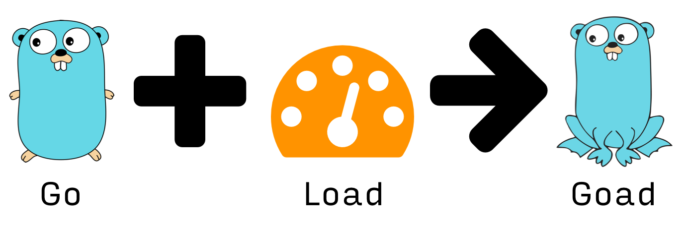
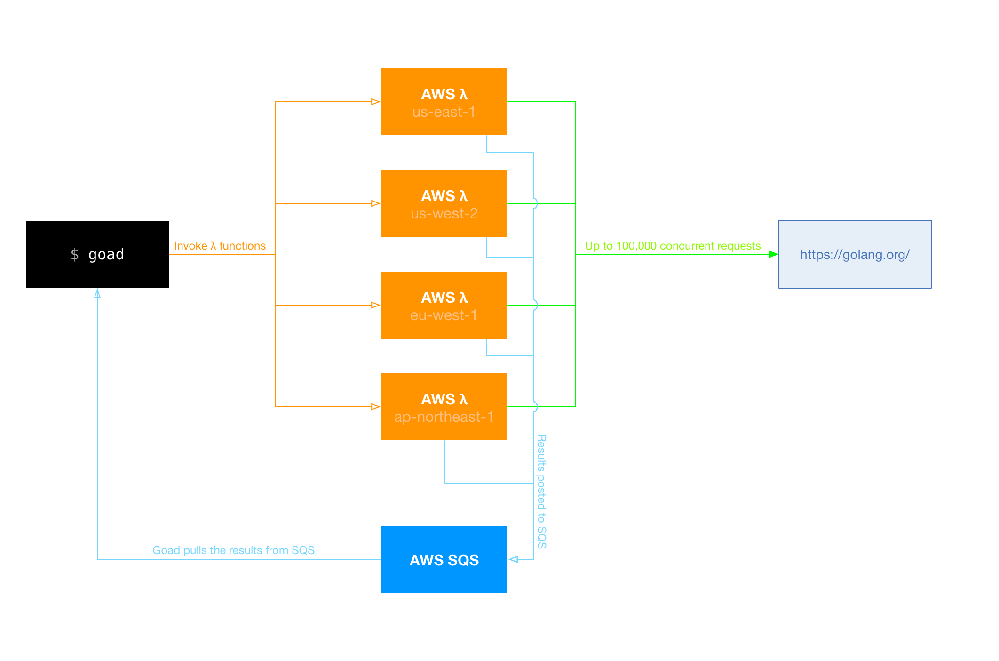

# Goad

Goad is an AWS Lambda powered, highly distributed,
load testing tool built in Go for the 2016 [Gopher Gala][].



## Installation

### Binary

The easiest way is to download a pre-built binary from [Goad.io] or from the [GitHub Releases][] page.

### From source

To build from scratch, make sure you have a working Go 1.5 workspace ([instructions](https://golang.org/doc/install)), then fetch the project with `go get`:

```
go get github.com/gophergala2016/goad
```

## Usage

### AWS credentials

Goad will read your credentials from `~/.aws/credentials` or from the `AWS_ACCESS_KEY_ID` and `AWS_SECRET_ACCESS_KEY` environment variables ([more info](http://blogs.aws.amazon.com/security/post/Tx3D6U6WSFGOK2H/A-New-and-Standardized-Way-to-Manage-Credentials-in-the-AWS-SDKs)).

### CLI

```sh
goad -n 1000 -c 5 https://example.com
```

## How it works

Goad takes full advantage of the power of Amazon Lambdas for distributed load testing. You can use goad to launch HTTP loads from up to four AWS regions at once. Each lambda can handle hundreds of concurrent connections, we estimate that Goad should be able to achieve peak loads of up to **100,000 requests/second**.



## How it was built

### Go CLI and server

* [AWS SDK for Go][]
* [Gorilla WebSocket][]
* [Termbox][]
* [UUID][]
* [bindata][]

### [Goad.io][] site

Because we we wanted to use React and ES6 to build the online demo, we opted to use a Node.js-based toolchain for the website. As far as we could tell, none of static site builders built with Go have built in support for an asset pipeline that would support ES6 modules out of the box or even easily…

We use WebSockets and React to present the results of the demo load test every few seconds as more results come in.

As we wanted to prevent the site from being used as a DDoS tool, the online demo is very limited but hopefully enough to demonstrate the usefulness of the CLI version of Goad.

* [WebPack][]
* [React][]
* [Babel][]
* [SCSS/Sass][]


## License & Copyright

MIT License. Copyright 2016 [Joao Cardoso][], [Matias Korhonen][], [Rasmus Sten][], and [Stephen Sykes][].

See the LICENSE file for more details.

[Goad.io]: https://goad.io
[GitHub Releases]: https://github.com/gophergala2016/goad/releases

[AWS SDK for Go]: http://aws.amazon.com/sdk-for-go/
[Gorilla WebSocket]: https://github.com/gorilla/websocket
[Termbox]: https://github.com/nsf/termbox-go
[UUID]: https://github.com/satori/go.uuid
[bindata]: https://github.com/jteeuwen/go-bindata

[WebPack]: https://webpack.github.io/
[React]: https://facebook.github.io/react/
[Babel]: https://babeljs.io/
[SCSS/Sass]: http://sass-lang.com/

[Gopher Gala]: http://gophergala.com/
[Joao Cardoso]: https://twitter.com/jcxplorer
[Matias Korhonen]: https://twitter.com/matiaskorhonen
[Rasmus Sten]: https://twitter.com/pajp
[Stephen Sykes]: https://twitter.com/sdsykes
